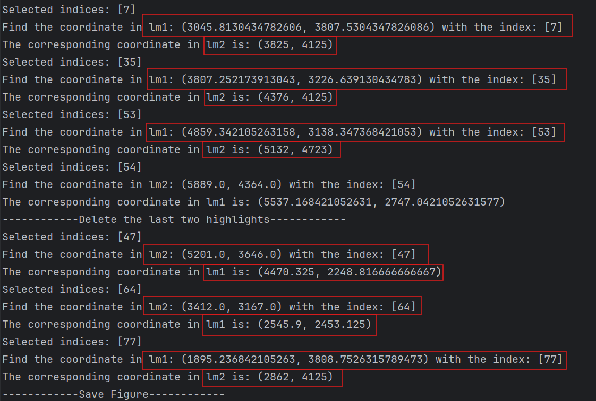

.. Hippo demo documentation master file, created by
   sphinx-quickstart on Tue Nov  5 19:12:41 2024.
   You can adapt this file completely to your liking, but it should at least
   contain the root `toctree` directive.

Mouse Hippocampus Analysis Documentation
========================================

.. toctree::
   :maxdepth: 1
   :caption: Contents:
   
   Mouse_Hippocampus_Analysis.ipynb
   Interactive_lm_select.ipynb

A demo using our tool to select landmarks interactively:

.. image:: _static/lm_select_demo.gif
   :alt:  A demo showcasting interactive selection of landmarks

When selecting the landmarks, the python output box shows the coordinates:

